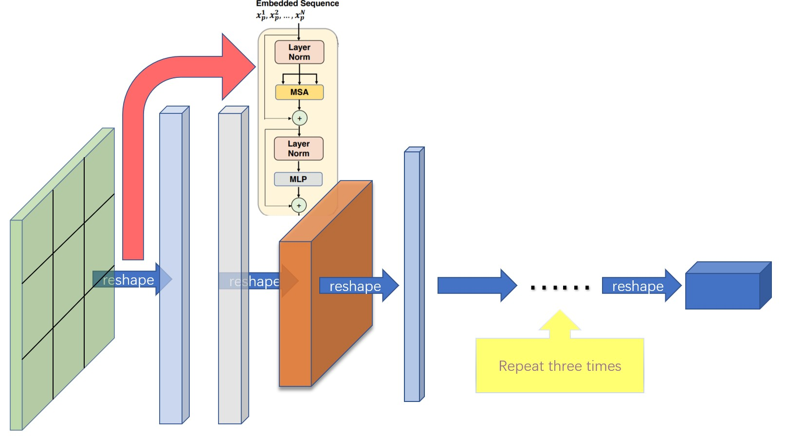

# The TTC block-Faster R-CNN Implementation

## 1. Introduction

This is a project for a new **feature extractor**, TTC block!

The is a brave try to challenge [the tranditional fully convolution](https://arxiv.org/abs/1409.1556) extractor structure!

The structure of TTC block is showed in the bellow.




## 2. Performance

### 2.1 mAP

VGG16 train on `trainval` and test on `test` split. 

**Note**: the training shows great randomness, you may need a bit of luck and more epoches of training to reach the highest mAP. However, it should be easy to surpass the lower bound. 

|              Implementation              |     mAP     |
| :--------------------------------------: | :---------: |
| [origin paper](https://arxiv.org/abs/1506.01497) |    0.699    |
|    train with caffe pretrained model     | 0.700-0.712 |
| train with torchvision pretrained model  | 0.685-0.701 |
| model converted from [chainercv](https://github.com/chainer/chainercv/tree/master/examples/faster_rcnn) (reported 0.706) |   0.7053    |
| TTC block| 0.713-0.719|

### 2.2 Speed

The large amounts of parameter lead to low speed, please prepare your patience and a good **[GPU](https://www.workstationspecialist.com/product/nvidia-tesla-a100/)**!


## 3. Install dependencies


Here is an example of create environ **from scratch** with `anaconda`

```sh
# create conda env
conda create --name simp python=3.7
conda activate simp
# install pytorch
conda install pytorch torchvision cudatoolkit=10.2 -c pytorch

# install other dependancy
pip install visdom scikit-image tqdm fire ipdb pprint matplotlib torchnet

# start visdom
nohup python -m visdom.server &

```

If you don't use anaconda, then:

- install PyTorch with GPU (code are GPU-only), refer to [official website](http://pytorch.org)

- install other dependencies:  `pip install visdom scikit-image tqdm fire ipdb pprint matplotlib torchnet`

- start visdom for visualization

```Bash
nohup python -m visdom.server &
```


## 4. Demo

Pretrained model is availale, please send a email to **2981431354@mial.dlut.edu.cn** to ask for! 

## 5. Train

### 5.1 Prepare data

#### Pascal VOC2007

1. Download the training, validation, test data and VOCdevkit

   ```Bash
   wget http://host.robots.ox.ac.uk/pascal/VOC/voc2007/VOCtrainval_06-Nov-2007.tar
   wget http://host.robots.ox.ac.uk/pascal/VOC/voc2007/VOCtest_06-Nov-2007.tar
   wget http://host.robots.ox.ac.uk/pascal/VOC/voc2007/VOCdevkit_08-Jun-2007.tar
   ```

2. Extract all of these tars into one directory named `VOCdevkit`

   ```Bash
   tar xvf VOCtrainval_06-Nov-2007.tar
   tar xvf VOCtest_06-Nov-2007.tar
   tar xvf VOCdevkit_08-Jun-2007.tar
   ```

3. It should have this basic structure

   ```Bash
   $VOCdevkit/                           # development kit
   $VOCdevkit/VOCcode/                   # VOC utility code
   $VOCdevkit/VOC2007                    # image sets, annotations, etc.
   # ... and several other directories ...
   ```

4. modify `voc_data_dir` cfg item in `utils/config.py`, or pass it to program using argument like `--voc-data-dir=/path/to/VOCdevkit/VOC2007/` .


### 5.2 [Optional]Prepare caffe-pretrained vgg16

If you want to use caffe-pretrain model as initial weight, you can run below to get vgg16 weights converted from caffe, which is the same as the origin paper use.

````Bash
python misc/convert_caffe_pretrain.py
````

This scripts would download pretrained model and converted it to the format compatible with torchvision. If you are in China and can not download the pretrain model, you may refer to [this issue](https://github.com/chenyuntc/simple-faster-rcnn-pytorch/issues/63)

Then you could specify where caffe-pretraind model `vgg16_caffe.pth` stored in `utils/config.py` by setting `caffe_pretrain_path`. The default path is ok.

If you want to use pretrained model from torchvision, you may skip this step.

**NOTE**, caffe pretrained model has shown slight better performance.

**NOTE**: caffe model require images in BGR 0-255, while torchvision model requires images in RGB and 0-1. See `data/dataset.py`for more detail. 

### 5.3 begin training


```bash
python train.py train --env='fasterrcnn' --plot-every=100
```

you may refer to `utils/config.py` for more argument.

Some Key arguments:

- `--caffe-pretrain=False`: use pretrain model from caffe or torchvision (Default: torchvison)
- `--plot-every=n`: visualize prediction, loss etc every `n` batches.
- `--env`: visdom env for visualization
- `--voc_data_dir`: where the VOC data stored
- `--use-drop`: use dropout in RoI head, default False
- `--use-Adam`: use Adam instead of SGD, default SGD. (You need set a very low `lr` for Adam)
- `--load-path`: pretrained model path, default `None`, if it's specified, it would be loaded.

you may open browser, visit `http://<ip>:8097` and see the visualization of training procedure as below:


## Troubleshooting

- dataloader: `received 0 items of ancdata` 

  see [discussion](https://github.com/pytorch/pytorch/issues/973#issuecomment-346405667), It's alreadly fixed in [train.py](https://github.com/chenyuntc/simple-faster-rcnn-pytorch/blob/master/train.py#L17-L22). So I think you are free from this problem.
  
- Windows support

  I don't have windows machine with GPU to debug and test it. It's welcome if anyone could make a pull request and test it.


## Acknowledgement
This work builds on many excellent works, which include:

- [Yusuke Niitani's ChainerCV](https://github.com/chainer/chainercv) (mainly)
- [Ruotian Luo's pytorch-faster-rcnn](https://github.com/ruotianluo/pytorch-faster-rcnn) which based on [Xinlei Chen's tf-faster-rcnn](https://github.com/endernewton/tf-faster-rcnn)
- [faster-rcnn.pytorch by Jianwei Yang and Jiasen Lu](https://github.com/jwyang/faster-rcnn.pytorch).It mainly refer to [longcw's faster_rcnn_pytorch](https://github.com/longcw/faster_rcnn_pytorch)
- All the above Repositories have referred to [py-faster-rcnn by Ross Girshick and Sean Bell](https://github.com/rbgirshick/py-faster-rcnn)  either directly or indirectly. 


